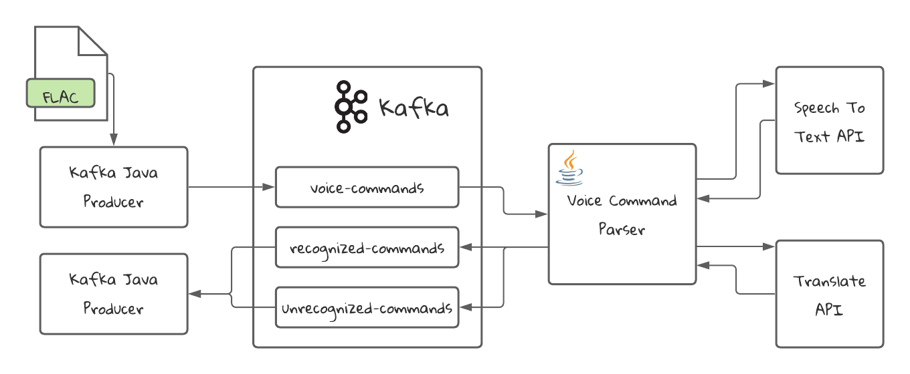

# Voice Command Parser: Processing in Kafka Streams

## Table of contents
* [Application](#Application)
* [Application Diagram](#application-diagram)
* [Technologies](#technologies)
* [Setup](#setup)

## Application
An application that will receive Voice Commands and will convert them into text commands.

The audio will be in FLAC format and is prepared to be used by the Speech To Text API in Google Cloud Platform.

The commands that are not in English will be translated to English to be further processed by a third hypothetical service.

## Application Diagram

## Setup
1. Clone this repository: git clone https://github.com/rbojan2000/voice-command-parser.git
